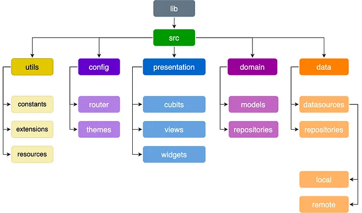
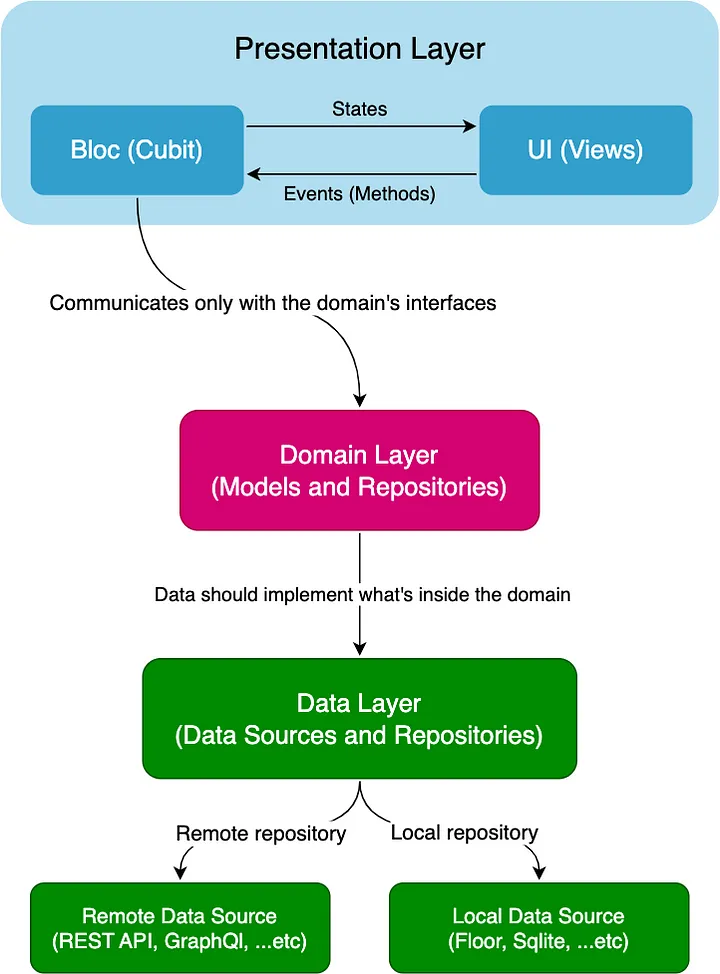

# Flutter News with clean architecture

1. Initial flutter project
```flutter pub get```
2. Run build runner
```dart run build_runner build --delete-conflicting-outputs```
3. Run flutter app
```flutter run```

### Tools/Libraries (Packages)
#### Packages
- **retrofit**: is a source code generator package that uses **Dio** as an http client to generate the proper methods we need to deal with REST APIs based on abstraction, it’s inspired by the Android Retrofit.
- **floor**: is a typesafe, reactive, lightweight source code generator package that uses the sqlite to store its data locally, it’s again inspired by Android Room.
- **flutter_bloc**: a flutter state management.
- **equatable**: a flutter package that makes comparing dart objects by equality is much easier.
- **get_it**: a service locator (also a runtime dependency injector).
- **flutter_hooks**: hooks inspired by React Hooks.
- **auto_route**: a routing package that uses the new Flutter Router instead of the default Navigator.
- **awesome_dio_interceptor**: an awesome Dio log interceptor, which logs network requests and response beautifully.
- **oktoast**: a customizable and easy-to-use flutter toast message package.
- **lint**: a flutter package that helps you write clean code which follows the Dart’s Style Guidelines.

#### Folder structure diagram



> Also, Create a file called “locator.dart” inside the lib/src folder, this will be responsible for injecting our dependencies using the get_it package.

#### The Architecture and Dependency Rule



##### Data Layer
The Data Layer is one of the layers in the architecture, responsible for managing the storage and retrieval of data used by the application. It interacts with the infrastructure of the application, such as the database, external APIs, or any other data source. It is also responsible for implementing the business logic related to data storage and retrieval. This includes implementing data access methods, handling data validation and mapping, and managing the data source connection and transactions.

One of the main advantages of using a Data Layer in Clean Architecture is that it makes it easier to switch between different data storage mechanisms without affecting the rest of the application. For example, if you need to switch from a SQL database to a NoSQL database, you can simply replace the implementation of the Data Layer without changing any of the other layers in the application.

Keep in mind, that each data source should has it’s own repository implementation.

##### Presentation Layer
In Clean Architecture, the Presentation Layer is the layer responsible for handling the user interface and user interaction with the application. It is the layer closest to the user and is responsible for presenting data and receiving input.

The Presentation Layer typically consists of user interface components, such as screens, forms, and widgets, and controllers or presenters that handle user input and interaction. It communicates with the Domain Layer through a set of interfaces or protocols that define the operations that can be performed by the user interface.

The benefit of using Presentation Layer is that it makes the codebase more modular and maintainable. By separating the user interface from the business logic and infrastructure, it becomes easier to modify and extend the application over time. Also it allows for different user interfaces to be developed and used with the same underlying business logic. For example, a web application, a mobile application, and a desktop application could all use the same Domain Layer, but have different Presentation Layers that are optimized for their respective platforms.

This layer in our series, contains two important parts: The Bloc (also ViewModels) and The UI

##### What is a BLoC and Why?

BLoC stands for (Business Logic Components), is a design pattern that is used to manage the state of an application. It separates the business logic from the UI, making it easier to manage and maintain the application’s codebase. The main purpose of BLoC is to provide a clean, reactive and scalable architecture that can handle complex user interfaces and state management.

BLoC pattern is implemented using streams in Dart, which allows for a reactive programming style. In this pattern, the business logic is handled by a bloc, which is a component that receives events from the UI, processes them, and emits new states. The UI, on the other hand, listens to these state changes and updates the UI accordingly.

By using Flutter BLoC, we can write clean, testable and maintainable code, while also benefiting from the advantages of reactive programming and stream-based state management.

Why it’s Loved and Popular by the Developers?

Separation of Concerns: Flutter BLoC allows for the separation of business logic and UI. This means that developers can focus on implementing the business logic in the BLoC without worrying about the UI, and vice versa.
Code Reusability: With Flutter BLoC, developers can create reusable business logic components that can be used across different parts of the application. This reduces code duplication and makes it easier to maintain the application’s codebase.
Predictable State Management: Flutter BLoC provides a predictable way of managing the state of the application. The BLoC emits new states in response to events from the UI, making it easier to reason about the application’s behavior.
Testability: Flutter BLoC makes it easier to write unit tests for the business logic of the application. Since the BLoC is separate from the UI, it can be tested independently of the UI.
Large and Complex Applications: Flutter BLoC is particularly well-suited for large and complex applications, as it provides a scalable architecture that can be extended as the application grows.
Recently, flutter_bloc’s developers have merged something called Cubit along with the Bloc, and basically Cubit is much more easier to use, it has (States and Cubit) but not Events (unlike bloc which has Events, States, Bloc), so instead of adding events in bloc here we just call methods directly from the cubit class.

In this series, we’re gonna be using Cubit instead of Bloc to make things simpler to understand, and it’s totally fine if you choose to work with Bloc since they both are state managements and do the same job but with different mechanism and implementation.

##### Domain Layer
The Domain Layer is the most important layer of the architecture, as it contains the core business logic of the application. It is responsible for representing the concepts and entities of the business domain, and it defines the rules and behavior of the application. The separation of concerns helps to ensure that the application’s business logic remains independent of the user interface, the data storage mechanism, and other external systems.

In Clean Architecture, the Domain Layer should be independent of any specific implementation or framework. This means that the code in the Domain Layer should be written in a technology-agnostic way, with no dependencies on external systems or libraries.

One of the main benefits of using a Domain Layer in Clean Architecture is that it makes the codebase more modular and maintainable. By separating the business logic from the infrastructure and user interface, it becomes easier to modify and extend the application over time.